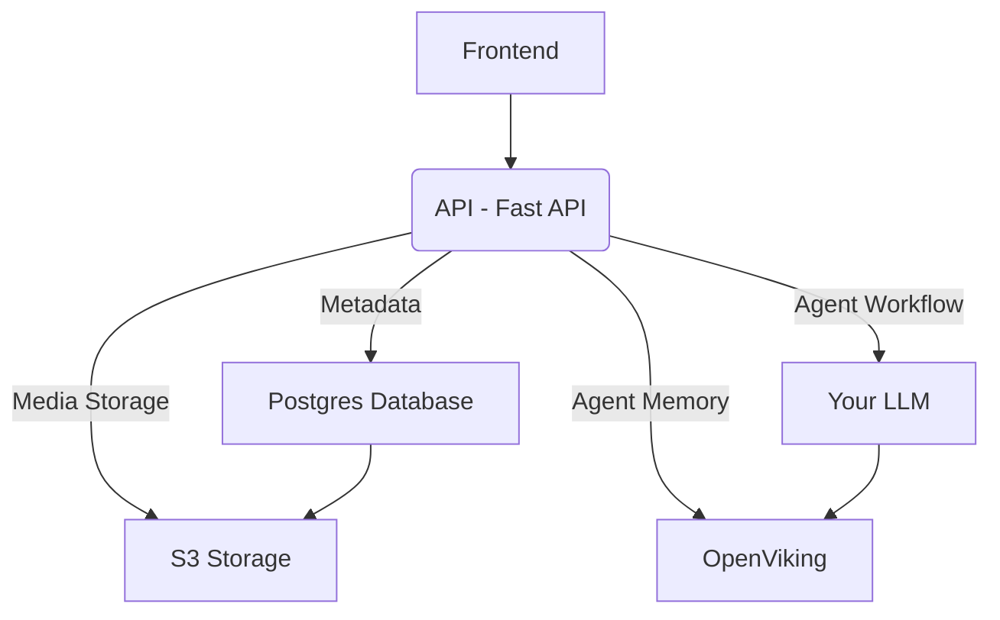

# 🌊 Wave by Entangle - Knowledge base for agents and humans

Wave by Entangle is an AI powered knowledge base built for AI agents and humans. 

Replacing traditional company knowledge base with modern agent driven knowledge base with information available to you when you need them.

## Architecture 

### Frontend 

Milkdown based markdown / WSIWYG editor. UI designed with Tailwind CSS.

### Back-end

Fast API based python back-end.
