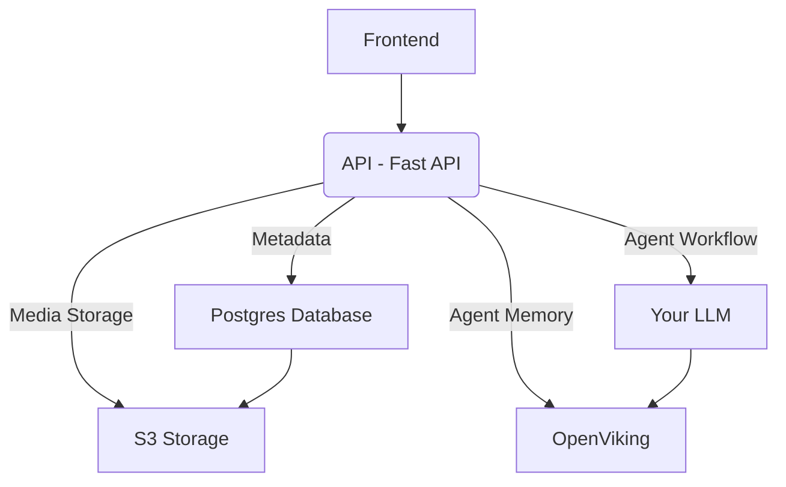

# 🌊 Wave


<p>
  <a title="Star the repository and support" href="https://github.com/entangle-cloud/wave"></a>
  &nbsp;&nbsp;
  <a title="Join our discord server" href="https://discord.gg/gRwxBDrN7v"></a>
   &nbsp;&nbsp;
  <a title="Join our discord server" href="https://docs.entangle.ch"></a>
</p>

Cut through the clutter. A knowledge hub for humans and AI agents to find information when you need them. No scrolling through scattered folders, wikis, and documents.

**Always up-to date with agents and human moderation.**

## Features

- Beautiful distraction free Markdown editor with user collaboration
- Content categorization with sharing with users
- Agent memory with virtual file-system support
- Bring your own keys for LLM and S3 storage
- Self hosted and Entangle Cloud host support

## Screenshots


## Environment Variables

To run this project, you will need to add the following environment variables to your `.env` file in the frontend and backend

### Frontend env variables 

Replace with Wave backend url

`VITE_API_ENDPOINT="http://localhost:3000`

### Backend env variables 

```bash
OPENVIKING_TOKEN="YOUR OPEN VIKIN TOKEN"
DATABASE_URL="POSTGRES DATABASE_URL"
OPENVIKING_MCP_URL="OPENVIKIN MCP ENDPOINT"
OPENVIKING_ENDPOINT="OPEN VIKING ENDPOINT"
JWT_SECRET="xxxxxx"
ACCESS_TOKEN_EXPIRE_MINUTES=60
R2_ACCESS_KEY="S3 BUCKET ACCESS KEY"
R2_ACCESS_SECRET="S3 BUCKET ACCESS SECRET"
R2_ENDPOINT="S3 ENDPOINT"
BUCKET_NAME="S3 BUCKET NAME"
GEMINI_API_KEY="GEMINI API KEY"
MODEL="models/gemini-3.8-flash"
```

## Roadmap

- [ ] Wave MCP API Endpoint for agent workflows
- [ ] Improving user interface
    
## Architecture 


